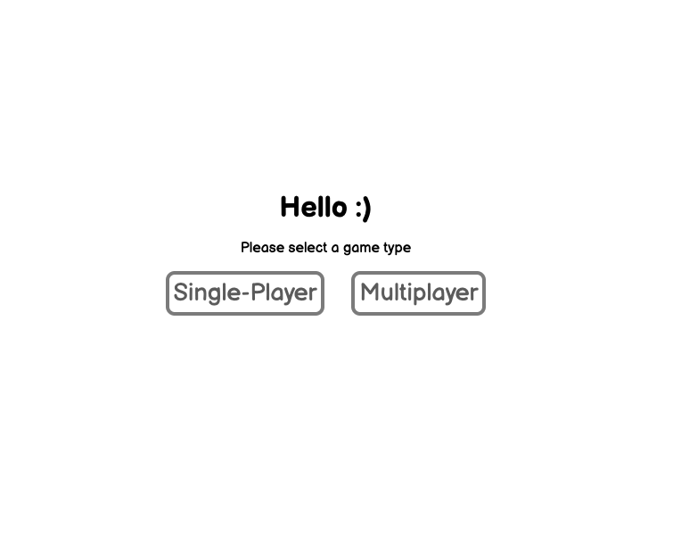
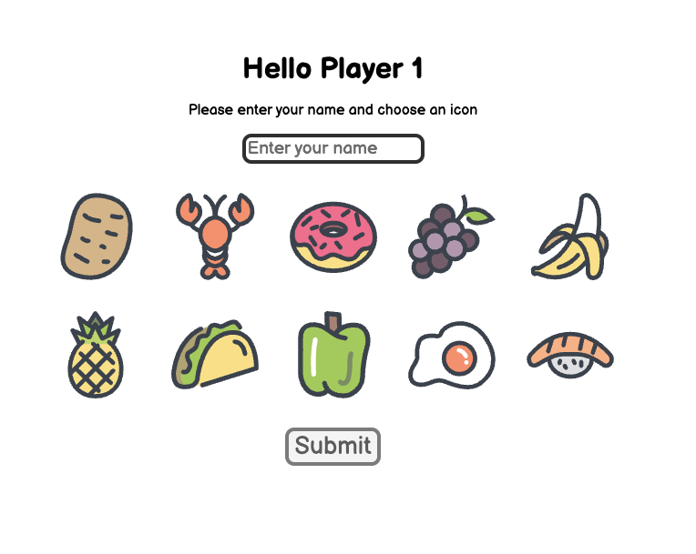
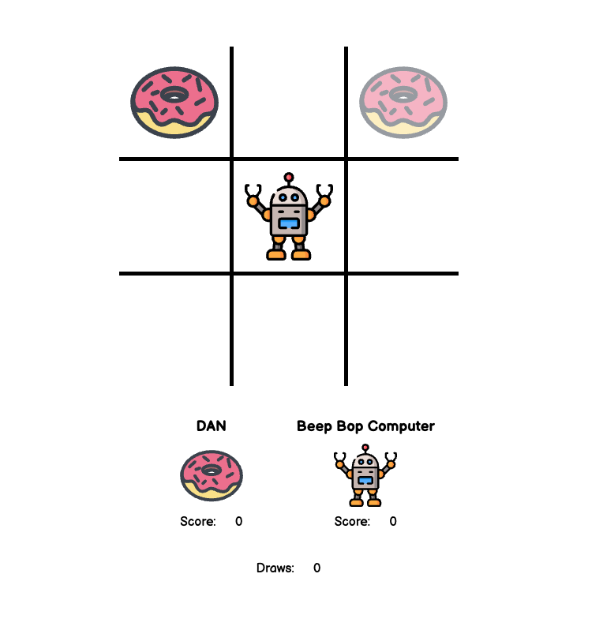
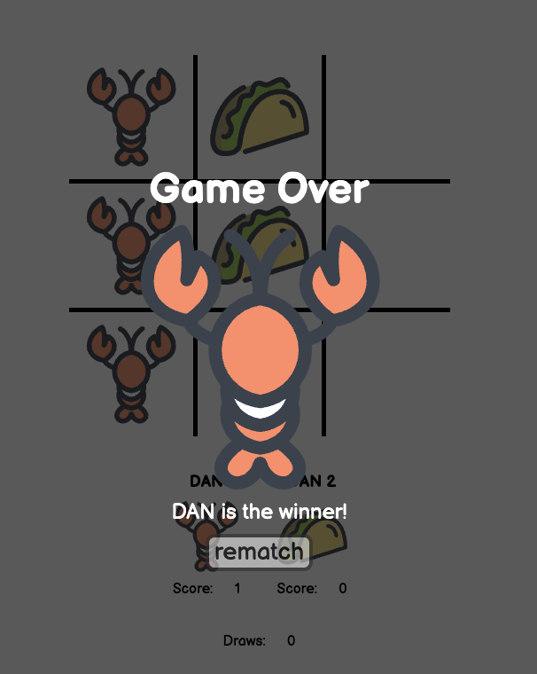

# Tic-Tac-Toe

Welcome to my Project 0.

It's a tic-tac-toe game built entirly from scratch using HTML, CSS, JavaScript and jQuery.

## Features

My build of the game has some cool features:
- Allows a choice between Multiplayer (for 2 humans to play) and Single-Player (where you can play against the computer)

- A very beatable AI

- Human players can enter their name and choose from a selection of character icons

- Once gameplay begins the game displays the current players turn by showing a ghosted version of their icon over the square they hover

- When the game is over, through a win or a draw the user is presented with a "Game Over" screen that displays the winning players icon and announces them as the the winner.
- From the Game Over screen users can choose to have a rematch, which will begin the game again.

- The game tracks each players score as well as the number of draws that have occured.

- The layout of the game is responsive to different screen sizes.

|
-|-
  |  

## How it works

The submit button stores the players name and icon into an object for that player.

When a player clicks a spot:
- an image is created
  - the source of the image is grabbed from the players object icon and the image is appended to the square that was clicked. 
  - The ID of the spot that was clicked is also pushed into an array within that player object and an overall board state array.

- To check for a win, when each spot is clicked the players array of spots is checked for any of the winning combinations.

- To check for a draw, the board state array is checked for length, essentially checking how many turns have been played.

- In the event of a win or a draw the game removes click events from all board spots, increments the score for the player or draw counter by 1 and updates the score board. Then the game over screen is displayed.

- If no win is detected the players turn variable is flipped and the game waits for the second player to click

When the rematch button is clicked:
- All the player icons on the board are removed
- Both the players and the board state arrays are emptied
- The click handler is turned back on
- The game is set back to player 1's turn

## Wishlist
- Make my implementation of Minimax algorithm work! Fix the AI
- Make the game switch the starting player after each turn
- Refactor!
- Make a replay function to view previous games

## Known Bugs
- The AI that is using recursion and the minimax algorithm and should be unbeatable is absolutley beatable.

## Play the game

[Tic-Tac-Toe](https://danyip.github.io/tic-tac-toe/)

